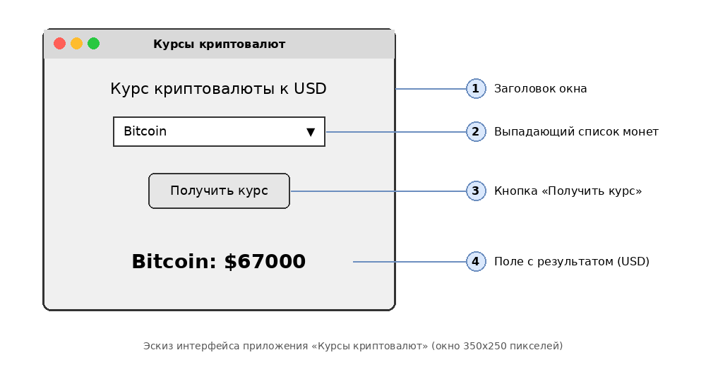

# Техническое задание
## на разработку приложения «Курсы криптовалют»

| | |
|---|---|
| Исполнитель | Шиловский Максим Витальевич  |
| Группа / курс | Азбука цифры. Python-программист |
| Дата | 06.10.2026 |

## 1. Общие сведения
- **Название:** Курсы криптовалют
- **Язык:** Python 3
- **Библиотеки:** Tkinter (графический интерфейс), requests (HTTP-запросы)
- **Платформы:** macOS, Windows, Linux

## 2. Цель
Создать настольное приложение с графическим интерфейсом, которое показывает текущий курс выбранной криптовалюты к доллару США (USD).

## 3. Источник данных
Открытое API CoinGecko: https://www.coingecko.com/en/api

- Метод: `GET https://api.coingecko.com/api/v3/simple/price`
- Параметры: `ids=<id монеты>`, `vs_currencies=usd`
- Пример ответа: `{"bitcoin": {"usd": 67000}}`
- API-ключ не требуется.

## 4. Функциональные требования
1. Выбор криптовалюты из выпадающего списка: Bitcoin, Ethereum, Solana, Dogecoin, Cardano, Ripple.
2. Кнопка «Получить курс» отправляет запрос к API.
3. Результат выводится в окне в виде «Название: $цена».
4. Если монета не выбрана, показывается предупреждение (`messagebox.showwarning`).
5. При ошибке (нет интернета, таймаут, пустой ответ API) показывается окно ошибки (`messagebox.showerror`), приложение не закрывается.

## 5. Нефункциональные требования
1. Таймаут запроса — не более 10 секунд.
2. Корректное отображение на macOS: тема `classic`, явные цвета фона (`#f0f0f0`) и текста (`black`).
3. Код разделён на функции и снабжён комментариями.

## 6. Эскиз интерфейса
Файл эскиза: `interface_sketch.png` (редактируемая версия: `interface_sketch.drawio`, открывается в app.diagrams.net).



Текстовая схема:

```
+------------------------------------------+
| Курсы криптовалют               [-][o][x]|
+------------------------------------------+
|                                          |
|        Курс криптовалюты к USD           |   (1) заголовок
|                                          |
|          [ Bitcoin             v ]        |   (2) выпадающий список
|                                          |
|            [ Получить курс ]             |   (3) кнопка
|                                          |
|             Bitcoin: $67000              |   (4) результат
|                                          |
+------------------------------------------+
```

## 7. Сценарии ошибок

| Ситуация | Реакция приложения |
|---|---|
| Монета не выбрана | `messagebox.showwarning` |
| Нет интернета | `messagebox.showerror` |
| Сервер не отвечает (таймаут) | `messagebox.showerror` |
| API вернуло пустой ответ или не 200 | `messagebox.showerror` |

## 8. План разработки (Git)
1. **Коммит 1:** структура проекта, окно, список и кнопка.
2. **Коммит 2:** запрос к API CoinGecko и вывод курса.
3. **Коммит 3:** обработка ошибок, ТЗ, эскиз и README.

## 9. Критерии приёмки
- Для каждой из 6 монет показывается актуальный курс в USD.
- Все ситуации из раздела 7 обрабатываются без падения программы.
- В репозитории не менее трёх коммитов.
